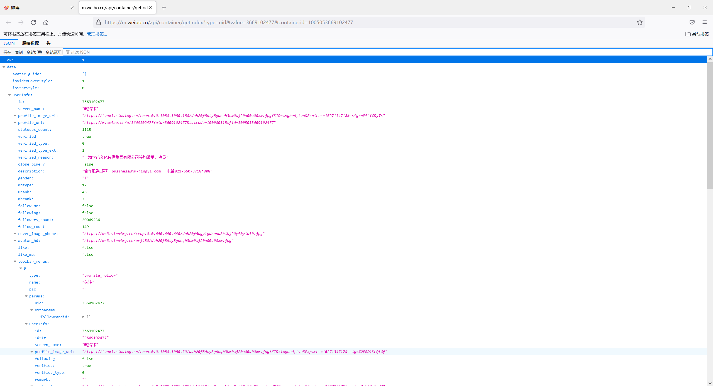

# Tiny Weibo Spider

    

## Warning!

终于放假并且摆脱了老板的魔爪，并且能够捡起自己去年这个时候写下的屎山代码~~（不是）~~

给自己定下了几个小目标，争取九月份之前，完成对爬虫的重构，实现代理池、中间件等模块化设计，并或许可能应该支持docker一键部署爬虫+数据库。旧的代码存储在了`v1.0`分支中，暂时还是可以使用的，新版微博爬虫在`dev`分支中进行开发，这里要特别感谢对我爬虫提出意见和改进的cyc大佬，当然由于特殊的原因我暂时无法联系他，也没办法将他加入到contributor中。

综上，开搞开搞。

## 以下是原版正文

这是一个基于 **Scrapy** 框架的迷你新浪微博爬虫，无需维护Cookie或者进行模拟登录，可以实现对新浪微博的较大规模数据采集。

大概是在19年的九月份，那时我还很菜（当然现在也很菜），由于项目需要被逼上马，前前后后折腾了大概一两个月，写出了这个爬虫的第一版。当然，现在回顾大约一年前自己写的代码，果然是不堪回首，难以入目，不管是从代码的简洁性、可读性还是可维护性看起来都是一坨shit。20年初参加了某个全国性的比赛，借机重构了这个爬虫，比起第一代的爬虫而言，砍掉了那些实在过于冗余的代码，调整了项目的结构，现在看起来总算是清爽很多了。

言归正传，**Tiny Weibo Spider** 是我基于新浪微博的移动站点（m站）[m.weibo.cn](https://m.weibo.cn/) 和 **Scrapy** 框架构建的一个轻量微博爬虫，并将采集到的数据存储到 **MongoDB** 中包括Scrapy框架初始化时自动创建的代码，加上一对乱七八糟的注释和缩进换行，总共的代码量也只有1500行左右，其中核心代码我估计也就300行上下。核心代码量虽然不多，但是实现的功能依然较为齐全。与针对微博PC站也是就 [weibo.com](https://weibo.com/) 使用者不需要去购买小号来进行模拟登录，然后抓取Cookie，维护一个用户池，单纯的使用单个IP也可以对微博中的用户数据进行采集；如果要进行大规模的数据采集，只需要使用代理IP即可（欢迎各大代理商找我投放广告）。

现目前这个微博爬虫只能部署在单个主机上运行，后面也可以开一个分支拓展成分布式的，不过最近升学压力有点大，可能要无限鸽了。据不准确估计，在有充足的代理IP的情况下，每天抓取的用户信息数量至少也是在**百万**及以上，顺带抓取了**千万条**博文，对于大部分的数据挖掘和分析工作来讲，我觉得这个采集效率是完全足够了？

### 项目说明

这是一个基于 **Scrapy** 框架的新浪微博爬虫，爬取的主要目标是新浪微博m站的数据，同时并使用了MongoDB对于爬取到的用户数据进行存储。

#### 为什么选择M站爬取数据

新浪微博的m站，即 [m.weibo.cn](https://m.weibo.cn/) ，为新浪微博的手机、平板等移动客户端提供数据。其中，绝大部分用户数据是以 **Ajax** 的形式**异步**请求加载的。由于新浪微博的PC站对于第三方爬虫部署了严格的反爬措施，包括必须要求用户登录才能够获取完整数据，暂时封禁某个请求过于频繁的IP地址等等，而新浪微博的M站的反爬措施相比PC站较少，用户不需要登录就可以获取足够完整的数据信息，因此，本项目选择新浪微博的m站进行爬取。但新浪微博m站中的用户数据分布较为零散，在获取同样完整性的数据前提下，面向m站的微博爬虫需要发起更多的网络请求，这也是限制这个爬虫爬取效率的一个原因。

#### 实现原理

前文中提到，新浪微博的m站以 **Ajax** 的形式异步请求用户数据，只要能够找到微博加载用户数据的URL，提取API接口，能够实现快速爬取微博用户数据。不得不说这是一种很取巧的爬取策略，新浪微博并没有针对这些 Ajax 数据请求接口进行身份认证（貌似现实中要认证也不太可行？），来自任意IP的正确请求都能够获得返回的数据，从而避免了模拟登录，用户池维护一堆麻烦的事情，某种程度上来说也算是提升了爬取效率。

以下图这个用户为例，首先通过微博m站访问用户的[主页](https://m.weibo.cn/u/5653796775)，然后打开F12开发者工具，查看m站发起的Ajax请求。


如下图所示，可以看到几个被触发的Ajax请求响应状态和信息，选择返回大小最大的包进行查看。



如下图所示，可以观察到微博服务器返回了json的形式用户数据。**即针对特定用户构造特定的数据请求URL，就能够实现用户数据地有效爬取**。这一点是这个本项目爬虫构建的关键。


#### 功能说明

本项目现目前总共实现了四个爬虫，其主要功能如下表所示。

| 爬虫名称        | 功能                                   |
| :-------------- | :------------------------------------- |
| WeiboSpdier     | 爬取指定用账户与博文信息               |
| FansListSpider  | 爬取指定用户粉丝与关注列表用户信息     |
| HotSearchSpider | 爬取现目前实时热搜                     |
| KeyWordsSpider  | 根据用户指定的关键词爬取用户发布的博文 |

### 运行环境

- Python >= 3.7.0
- MongoDB >= 3.6.17
- 操作系统 Windows/Linux

### 项目依赖

```
lxml==4.4.1
fake_useragent==0.1.11
Scrapy==1.6.0
pymongo==3.10.1
```

### 使用说明

#### 1.下载程序

```
git clone git@github.com:CharesFang/Tiny-Weibo-Spider.git
cd Tiny-Weibo-Spider
pip install -r requirements.txt
```

#### 2.数据库配置

1. 创建一个MongoDB数据库，在云服务器、虚拟机或者docker里都可。
2. 进入创建的数据库中，并创建以下集合或者根据自己的需求修改`pipelines.py`中的相关代码。（其实数据库结构还可以继续优化，不过以后再说吧hh）
   - user：存储用户账户数据
   - post：存储用户博文数据
   - follows：存储用户关注者数据
   - followers：存储用户粉丝数据
   - hot_search：存储实时热搜数据
   - key_words：存储根据关键词爬取到的用户博文数据
   - total_num：存储用户发布的博文总数
3. 在 `WeiboSpider`文件夹下有一个`database_tool.py`文件，根据自己的数据库配置完善`DBConnector`类。

#### 3.代理配置

1. 可以修改`settings.py`，将代理与UA中间件禁用，若如此设置，爬虫将不会为每个请求添加代理与UA。

   ```python
   DOWNLOADER_MIDDLEWARES = {
       # 禁用Scrapy自带的代理中间件与UA中间件，启用用户自定义的中间件
       'scrapy.downloadermiddleware.useragent.UserAgentMiddleware': None,
       'scrapy.contrib.downloadermiddleware.httpproxy.HttpProxyMiddleware': None,
       # 'WeiboSpider.middlewares.RandomUaAndProxyIpMiddleware': 400,
       'WeiboSpider.middlewares.RandomUaAndProxyIpMiddleware': None,
       'WeiboSpider.middlewares.RetryMiddleware': 544,
   }
   ```

2. 启用`settings.py`中的`RandomUaAndProxyIpMiddleware`中间件，为每个请求添加代理与UA，配置信息如下：

   ```python
   DOWNLOADER_MIDDLEWARES = {
       # 禁用Scrapy自带的代理中间件与UA中间件，启用用户自定义的中间件
       'scrapy.downloadermiddleware.useragent.UserAgentMiddleware': None,
       'scrapy.contrib.downloadermiddleware.httpproxy.HttpProxyMiddleware': None,
       'WeiboSpider.middlewares.RandomUaAndProxyIpMiddleware': 400,
       # 'WeiboSpider.middlewares.RandomUaAndProxyIpMiddleware': None,
       'WeiboSpider.middlewares.RetryMiddleware': 544,
   }
   ```

   然后修改`middlewares.py`中的`RandomUaAndProxyIpMiddleware`类，重写`get_proxy_ip`方法，每次返回一条代理IP信息，形如`https://xxx.xxx.xxx.xxx:xxxx`，并修改`process_request`方法为如下；

   ```python
   def process_request(self, request, spider):
       proxy = RandomUaAndProxyIpMiddleware.get_proxy_ip(self.ip_num)
       request.meta['proxy'] = proxy
       request.headers['User-agent'] = self.ua.random
   ```

3. 其实这一部分代码感觉耦合程度有点高，后面再修改吧，改起来稍微繁琐了一点，但也不是不能用（滑稽）

#### 4.运行

##### 程序运行

1. 直接输入命令`scrapy crawl WeiboSpider -a uid=xxxxxxxx`等，输入爬虫必要运行参数，运行对应爬虫。
2. 执行名 `python main.py`，根据提示输入对应的爬虫命令与参数，同样调用相应的爬虫

##### 参数说明

本项目内置每个爬虫的对应参数说明如下表所示。

| 爬虫名称        | 参数说明                                                     |
| --------------- | ------------------------------------------------------------ |
| WeiboSpdier     | uid：目标用户uid，多个uid之间以 '\|' 分隔，不能为空；page：爬取用户博文页数，默认为3 |
| FansListSpider  | uids：目标用户uid，多个uid之间以 '\|' 分割；fans_end：粉丝列表爬取页数，默认10；follows_end：关注列表爬取页数，默认10 |
| HotSearchSpider | 无                                                           |
| KeyWordsSpider  | keywords：爬取关键词，不能为空；page_num，爬取页数，默认为5  |

